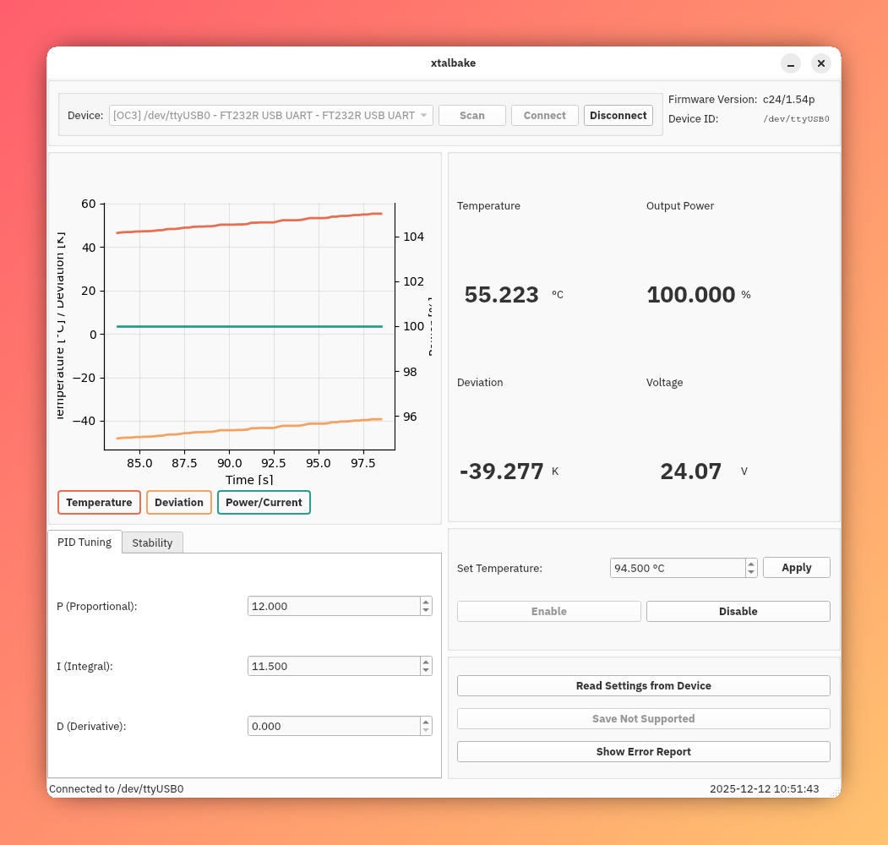

# xtalbake

A Python package and GUI tool for controlling and monitoring temperature controllers over serial connections. The package provides a unified interface for multiple device types through a protocol-based architecture, with support for the MTD1020T TEC Controller and Covesion OC3 Oven Controller.



## Overview

xtalbake uses a protocol-based design to standardize interaction with different temperature controller hardware. Devices are automatically discovered via USB VID:PID identification, and a factory function simplifies instantiation. This architecture allows seamless support for multiple controller types while maintaining a consistent programming interface.

## Features

- Unified protocol-based interface for multiple temperature controller types
- Automatic device discovery via USB VID:PID
- Factory function for simplified controller instantiation
- PyQt-based GUI for interactive control
- Support for multiple controller types:
  - MTD1020T TEC (Thermoelectric Cooler) Controller
  - Covesion OC3 Oven Controller

## Installation

Clone and install directly from GitHub:

```bash
pip install git+https://github.com/Peter-Barrow/xtalbake.git
```

### Linux

On Linux systems, USB serial devices sometimes need additional setup. Here's what you might need to do:

#### Required Dependencies

First, install the FTDI library (the exact package name varies by distribution):

```bash
# Fedora/RHEL/CentOS
sudo dnf install libftdi

# Debian/Ubuntu
sudo apt install libftdi1-2
```

#### Device Not Appearing?

If your device shows up in `lsusb` but isn't accessible, you'll need to load the FTDI serial driver and register your device.

**Step 1:** Find your device's VID:PID by running:

```bash
lsusb
```

Look for your controller in the output. You'll see something like `Bus 001 Device 005: ID 0403:6001 Future Technology Devices`. The numbers after `ID` are your VID:PID (in this case `0403:6001`).

**Step 2:** Load the FTDI serial driver:

```bash
sudo modprobe ftdi_sio
```

**Step 3:** Register your device with the driver (replace `<VID>` and `<PID>` with your actual values):

```bash
echo "<VID> <PID>" | sudo tee /sys/bus/usb-serial/drivers/ftdi_sio/new_id
```

For example, for a device with VID:PID of `0403:6001`:

```bash
echo "0403 6001" | sudo tee /sys/bus/usb-serial/drivers/ftdi_sio/new_id
```

Your device should now appear as `/dev/ttyUSB0` (or similar) and be ready to use.

#### Troubleshooting

If you're still having issues, check whether the driver is properly loaded:

```bash
lsusb -t -v
```

This shows the USB device tree with driver information. Your device should show `ftdi_sio` as the driver. If it doesn't, try unplugging and replugging the device after completing the steps above.

## Protocol Architecture

Temperature controllers in xtalbake implement one or more protocols that define standardized interfaces. This allows different hardware to be controlled through a common API while still supporting device-specific features.

### Core Protocols

All temperature controllers must implement these base protocols:

#### CoreTemperatureControl

The minimum interface for basic temperature control. All temperatures are in degrees Celsius.

- `is_enabled()` - Check if temperature control is enabled
- `enable_temperature_control()` - Enable temperature control
- `disable_temperature_control()` - Disable temperature control
- `get_temperature_setpoint()` - Get current temperature setpoint
- `set_temperature_setpoint(temp_celsius)` - Set target temperature
- `get_actual_temperature()` - Get actual measured temperature

#### DeviceIdentification

Device information and identification.

- `get_firmware_version()` - Get device firmware version
- `get_device_uuid()` - Get unique device identifier (if available)
- `get_device_model()` - Get device model name

#### ErrorReporting

Standardized error handling across devices.

- `get_error_code()` - Get current error code (bitmask)
- `get_error_flags()` - Get ErrorFlags handler for this device
- `get_active_errors()` - Get list of active error conditions
- `reset_errors()` - Reset/clear error register

#### PIDConfiguration

PID control loop configuration.

- `get_pid_p()` - Get proportional gain
- `set_pid_p(value)` - Set proportional gain
- `get_pid_i()` - Get integral gain
- `set_pid_i(value)` - Set integral gain
- `get_pid_d()` - Get derivative gain
- `set_pid_d(value)` - Set derivative gain

#### PowerMonitoring

Monitor power consumption and supply.

- `get_power()` - Get current power consumption
- `get_supply_voltage()` - Get supply voltage

### Device-Specific Protocols

Additional protocols provide specialized features:

#### CurrentLimitControl (MTD1020T)

Control TEC current limits.

- `get_current_limit()` - Get TEC current limit in amperes
- `set_current_limit(limit_amps)` - Set current limit
- `get_actual_current()` - Get actual current and heating/cooling mode

#### ErrorMasking (MTD1020T)

Selectively mask error conditions.

- `get_masked_errors()` - Get currently masked error bitmask
- `mask_error(error_bit)` - Mask a specific error
- `unmask_error(error_bit)` - Unmask a specific error
- `unmask_all_errors()` - Unmask all errors

#### AlarmManagement (OC3)

Temperature alarm threshold configuration.

- `get_alarm_low()` - Get low temperature alarm threshold
- `set_alarm_low(temp_celsius)` - Set low alarm threshold
- `get_alarm_high()` - Get high temperature alarm threshold
- `set_alarm_high(temp_celsius)` - Set high alarm threshold
- `get_alarm_status()` - Get current alarm status

#### RampControl (OC3)

Controlled temperature ramping.

- `get_ramp_rate()` - Get ramp rate in degrees/minute
- `set_ramp_rate(rate_deg_per_min)` - Set ramp rate

#### TemperatureCycling (OC3)

Automated temperature cycling.

- `get_cycle_count()` - Get number of completed cycles
- `is_cycling()` - Check if cycling is active

#### TemperatureStabilityMonitoring (OC3)

Monitor temperature stability.

- `get_temperature_stability_status()` - Check if temperature is stable
- `get_stability_window()` - Get stability window thresholds
- `set_stability_window(low, high)` - Set stability window

### ErrorFlags System

The `ErrorFlags` class provides universal error handling for any device type. Each device defines its own error conditions with associated severity levels:

- **Severity.CRITICAL** - Severe errors requiring immediate attention
- **Severity.WARNING** - Non-critical issues that should be monitored
- **Severity.INFO** - Informational status messages

The ErrorFlags handler provides:
- `from_code(code)` - Parse error code into flags
- `list_active(code)` - Get list of active error flags
- `get_descriptions(code)` - Get human-readable error descriptions
- `get_details(code)` - Get detailed error information with severity
- `has_critical(code)` - Check for critical errors
- `format_report(code)` - Generate formatted error report

## Usage

### Device Discovery and Instantiation

The recommended way to connect to controllers is using the automatic discovery system:

```python
from xtalbake import discover, create_controller

# Discover all connected temperature controllers
devices = discover()
for port, description, controller_type in devices:
    print(f'{port}: [{controller_type}] {description}')

# Create controller for first discovered device
if devices:
    port, _, _ = devices[0]
    controller = create_controller(port)
    print(controller.get_firmware_version())
```

You can also run device discovery from the command line:

```bash
python -m xtalbake.device_discovery
```

### Direct Instantiation

If you know your device type and port, you can instantiate directly:

```python
from xtalbake import MTD1020T, OC3

# MTD1020T TEC Controller
with MTD1020T(port="/dev/ttyUSB0") as tec:
    print(tec.get_firmware_version())
    tec.set_temperature_setpoint(25.0)  # degrees Celsius

# Covesion OC3 Oven Controller
with OC3(port="/dev/ttyUSB1") as oven:
    print(oven.get_firmware_version())
    oven.set_temperature_setpoint(45.0)
```

### As a GUI

To launch the graphical interface:

```bash
xtalbake-gui
```

This will open a window where you can connect to controllers, adjust temperature settings, configure PID parameters, and monitor device status.

## Supported Devices

### MTD1020T TEC Controller

The MTD1020T is a precision thermoelectric cooler controller with the following features:

#### System Information
- Firmware version query
- Device UUID
- Error register with multiple error conditions

#### Temperature Control
- Temperature range: 5°C to 45°C
- Temperature window and delay configuration
- Actual temperature monitoring

#### TEC Current Management
- Current limit: 200-2000 mA
- Actual current and voltage monitoring
- Heating/cooling mode detection

#### PID Tuning
- Configurable P, I, D gains
- Cycle time adjustment
- Loop test parameters (critical gain and period)

#### Safety Features
- Maskable error conditions
- Error register reset
- Multiple error detection (sensor faults, thermal issues, etc.)

#### Configuration
- Non-volatile memory storage
- Context manager support

#### Example Usage

```python
from xtalbake import MTD1020T

with MTD1020T(port="/dev/ttyUSB0") as tec:
    # System info
    print(f"Firmware: {tec.get_firmware_version()}")
    print(f"UUID: {tec.get_device_uuid()}")
    
    # Temperature control
    tec.set_temperature_setpoint(25.0)  # 25°C
    actual = tec.get_actual_temperature()
    print(f"Actual temperature: {actual}°C")
    
    # Current control
    tec.set_current_limit(1.5)  # 1.5A
    current, mode = tec.get_actual_current()
    print(f"Current: {current}A ({mode})")
    
    # PID configuration
    tec.set_pid_p(1000)
    tec.set_pid_i(50)
    tec.set_pid_d(10)
    
    # Check for errors
    error_code = tec.get_error_code()
    if error_code:
        errors = tec.get_error_flags()
        print(errors.format_report(error_code))
    
    # Save configuration
    tec.save_configuration()
```

### Covesion OC3 Oven Controller

The Covesion OC3 is a precision oven controller designed for crystal heating applications:

#### System Information
- Firmware version query
- Device model identification
- Comprehensive error reporting

#### Temperature Control
- Wide temperature range
- Actual temperature monitoring
- Temperature stability detection

#### Alarm Management
- Low and high temperature alarms
- Alarm status monitoring
- Configurable alarm thresholds

#### Ramping Control
- Controlled temperature ramping
- Configurable ramp rate in °C/min

#### Temperature Cycling
- Automated temperature cycling
- Cycle count tracking
- Cycling status monitoring

#### Stability Monitoring
- Temperature stability window
- Stability status reporting

#### Power Monitoring
- Power consumption tracking
- Supply voltage monitoring

#### Example Usage

```python
from xtalbake import OC3

with OC3(port="/dev/ttyUSB0") as oven:
    # System info
    print(f"Firmware: {oven.get_firmware_version()}")
    print(f"Model: {oven.get_device_model()}")
    
    # Temperature control
    oven.enable_temperature_control()
    oven.set_temperature_setpoint(45.0)  # 45°C
    actual = oven.get_actual_temperature()
    print(f"Actual: {actual}°C")
    
    # Alarm configuration
    oven.set_alarm_low(40.0)
    oven.set_alarm_high(50.0)
    if oven.get_alarm_status():
        print("Temperature alarm active!")
    
    # Ramp control
    oven.set_ramp_rate(5.0)  # 5°C per minute
    
    # Check stability
    if oven.get_temperature_stability_status():
        print("Temperature is stable")
    
    # Monitor power
    power = oven.get_power()
    voltage = oven.get_supply_voltage()
    print(f"Power: {power}W, Supply: {voltage}V")
    
    # Check errors
    error_code = oven.get_error_code()
    if error_code:
        errors = oven.get_error_flags()
        print(errors.format_report(error_code))
```

## Adding New Devices

To add support for a new temperature controller:

1. Create a new module implementing the required protocols
2. Register the device's USB VID:PID in `device_discovery.py`:

```python
CONTROLLER_REGISTRY: Dict[Tuple[int, int], Type] = {
    (0x1313, 0x80C9): MTD1020T,  # MTD1020T VID:PID
    (0x0403, 0x6001): OC3,        # OC3 VID:PID
    (0xABCD, 0x1234): YourDevice, # Your device VID:PID
}
```

3. Ensure your device class implements at minimum:
   - `CoreTemperatureControl`
   - `DeviceIdentification`
   - `ErrorReporting`
   - `PIDConfiguration`
   - `PowerMonitoring`

4. Define device-specific error conditions using `ErrorFlags.from_definitions()`

## Requirements

- Python 3.10+
- [PyQt6](https://pypi.org/project/PyQt6/)
- [pyserial](https://pypi.org/project/pyserial/)
- [matplotlib](https://pypi.org/project/matplotlib/)

## Contributing

When adding support for new devices, please ensure they implement the appropriate protocols from `_tec_protocol.py` and add comprehensive documentation to this README.
